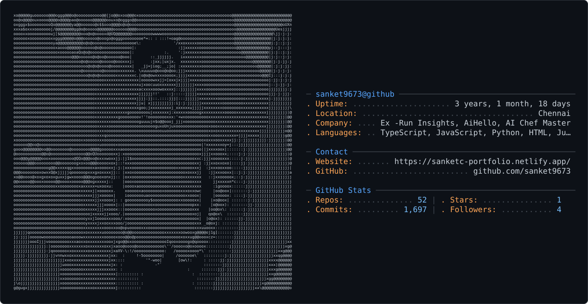

# Sanket Kisan Chavhan

### Software Engineer — Full-Stack & AI Systems

**Building full-stack products with AI at the core**

 

  

**LLMs · RAG · LangChain · LangGraph · AI Agents · Python · React · FastAPI · SQL · System Design**

---

<!-- GitHub ASCII Profile -->

<picture>
  <source media="(prefers-color-scheme: dark)" srcset="dark_mode.svg" />
  <source media="(prefers-color-scheme: light)" srcset="light_mode.svg" />
  
</picture>

---

## About

Full-stack Software Engineer focused on building **production-ready products with AI at the core**.

Experienced across **data validation pipelines, GenAI-powered dashboards, ML classification systems, and modern web applications**. Comfortable owning features end-to-end — from database schema and backend APIs to frontend experiences, testing, and deployment.

Currently exploring **LLMs, RAG, LangChain, LangGraph, AI agents, and scalable system design**.

---

## Experience

### Software Development Engineer Intern — RunInsights

**Delaware, US · Sep 2025 – Oct 2025**

- Built a modular **Python data validation pipeline** that eliminated manual entry across **3 reporting workflows** and reduced reporting errors by **25%**.
- Wrote **SQL anomaly detection queries across 200K+ rows** to identify data-quality issues early in ETL, reducing downstream failures by **20%**.
- Shipped automated tests with **80%+ coverage** and integrated them into CI/CD workflows.

### Frontend Developer Intern — AiHello

**Toronto, Canada · Feb 2025 – Jun 2025**

- Delivered **6 production features** using React and Python across four sprint cycles.
- Used Lighthouse-driven optimization to reduce average page load time from **3.2s to 1.9s**.
- Integrated a **LangChain-based GenAI summarization feature** into the product.
- Added request-level tracing that reduced debugging time by approximately **35%**.

### Frontend Developer & UI Designer Intern — AI Chef Master

**Mumbai, India · Sep 2024 – Jan 2025**

- Profiled React rendering performance and refactored data-fetching and memoization across **8 components**, improving Lighthouse scores by **40%**.
- Built and shipped a **Storybook component library**, reducing UI-related bug reports by **30%**.
- Contributed across frontend development and UI design to improve product consistency and usability.

---

## Projects

> Building practical systems at the intersection of **software engineering, AI, and data**.

### AI & Full-Stack Systems

- **GenAI-powered applications** — Building applications around LLMs, retrieval-augmented generation, structured prompting, and AI workflows.
- **Agentic systems** — Exploring LangChain, LangGraph, tool calling, multi-step workflows, and autonomous task execution.
- **Production web applications** — Developing full-stack products using React, Python, FastAPI, SQL, and modern frontend tooling.

---

## Publication

### Signature Forgery Detection using Neural Networks

*Indian Journal of Natural Sciences · Vol. 16 · Issue 89 · Apr 2025*

Developed a **Siamese Neural Network in TensorFlow** for signature verification using **3,000 signature pairs**, achieving **95% verification accuracy** and a **15% F1-score improvement** through grid-search tuning.

---

## Technical Stack

### Languages

`Python` · `C++` · `C` · `JavaScript` · `TypeScript`

### Frontend

`React` · `HTML` · `CSS` · `Tailwind CSS`

### Backend & Data

`Node.js` · `FastAPI` · `SQL` · `MySQL`

### AI / ML

`TensorFlow` · `LLMs` · `RAG` · `LangChain` · `LangGraph` · `AI Agents`

### Tools & Design

`Git` · `GitHub` · `Figma` · `Storybook`

---

## Engineering Focus

| Area | Focus |
| --- | --- |
| **AI Engineering** | LLMs · RAG · AI Agents · LangChain · LangGraph |
| **Backend** | Python · FastAPI · REST APIs · SQL |
| **Frontend** | React · TypeScript · Performance Optimization |
| **Machine Learning** | TensorFlow · Neural Networks · Classification |
| **System Design** | Scalable APIs · Data Pipelines · Architecture |
| **Engineering Quality** | Testing · CI/CD · Observability · Data Validation |

---

## GitHub

**Open-source contributions, experiments, and engineering work**

 

---

## Let's Connect

I'm interested in building **AI-powered products, scalable software systems, and developer-focused tools**.

 

<a href="https://sanketc-portfolio.netlify.app/">Portfolio</a>
&nbsp; · &nbsp;
<a href="https://www.linkedin.com/in/sanket-kisan-chavhan/">LinkedIn</a>
&nbsp; · &nbsp;
<a href="mailto:sanketch9673@gmail.com">Email</a>
&nbsp; · &nbsp;
<a href="https://codeforces.com/profile/sanket_9673">Codeforces</a>

  

📍 Bengaluru, India  
✉️ sanketch9673@gmail.com

  

